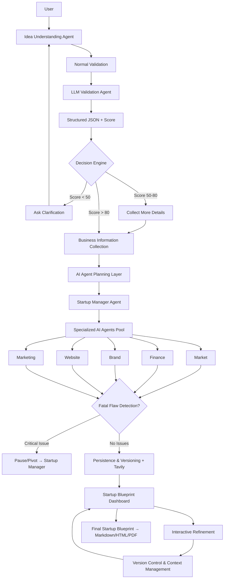

# AGENT.md — Agentic Workflow

Guidance for AI agents working on this codebase. Read this before making changes.

## Project summary

**Agentic Workflow** is a multi-agent startup blueprint builder. Users submit a business idea, pass validation, provide business context, and receive a structured blueprint covering market intelligence, financial modeling, brand, digital presence, and growth planning — with interactive refinement and export.

**Current implementation:** A frontend-only React SPA with **mock** agent behavior (timeouts, hardcoded outputs, simulated chat). There is **no backend**, **no real LLM integration**, **no Tavily search**, and **no persistent blueprint data** beyond a localStorage auth flag.

**Target architecture:** Defined in [context/architectureDesign.mmd](./context/architectureDesign.mmd) and [context/Workflow v-2.docx](./context/Workflow%20v-2.docx). When implementing features, align UI and data flow with those documents unless the user specifies otherwise.

| Item | Value |
|------|-------|
| App name (UI) | Agentic Workflow |
| Package name | `temp-app` (Vite scaffold default — consider renaming) |
| Workspace layout | Repo root is `d:\agentic\`; the app lives in `agentic/` |
| Design reference | [DESIGN.md](./DESIGN.md) (Duna-inspired design system) |
| Architecture diagram | [context/architectureDesign.mmd](./context/architectureDesign.mmd) |
| Workflow spec | [context/Workflow v-2.docx](./context/Workflow%20v-2.docx) |

## Target workflow (product spec)

End-to-end flow from the workflow document:

```
User
  → Idea Understanding Agent
  → Business Information Collection
  → AI Agent Planning Layer
  → Specialized AI Agents
  → Startup Blueprint Dashboard
  → Interactive Refinement
  → Final Startup Blueprint
```

### Phase 1: Idea Understanding Agent

Validates and scores the user's business idea before proceeding.

```
User Input
  → Normal Validation (required fields: completeness)
  → LLM Validation Agent (Clarity & Coherence, Actionability/Relevance, Competitive Uniqueness)
  → Structured JSON Output (with score)
  → Decision Engine
```

| Score | Action |
|-------|--------|
| **< 50** | Ask clarification → user resubmits → back to Idea Agent |
| **50–80** | Collect more details → proceed to Business Information Collection |
| **> 80** | Proceed directly to Business Information Collection |

**LLM validation criteria:** clarity/coherence, actionability/relevance, competitive uniqueness (similar businesses, pivot opportunities, points of distinction).

**Current UI gap:** `IdeaPromptPage` accepts free text and advances on non-empty input only. No validation pipeline, scoring, clarification loop, or structured JSON.

### Phase 2: Business Information Collection

AI-guided questionnaire. Required fields per spec:

| Field | Notes |
|-------|-------|
| Location | Geographic context |
| Budget | Startup capital constraints |
| Target customers | Primary audience |
| Business type | Category / model |
| Experience level | Founder background |
| Goal type | Small local business · Scalable startup · Online business |
| Core painpoint | Problem being solved |
| Launch timeline | Time-to-market |

**Current UI gap:** `BusinessInfoPage` only collects target audience and revenue stream (subscription / one-time / ad-supported). Missing most spec fields.

### Phase 3: AI Agent Planning Layer

**Startup Manager Agent** (orchestrator) receives collected context, creates tasks, and distributes work to specialized agents.

**Fatal flaw signaling:** If any agent finds a critical issue (e.g., total market saturation), it signals the Startup Manager to **pause or pivot** the workflow. The orchestrator reassesses and may re-plan.

**Current UI gap:** `PlanningPage` shows a 3s spinner and auto-navigates. No orchestrator logic, task creation, or fatal-flaw handling.

### Phase 4: Specialized AI Agents

Agents run in parallel under the Startup Manager. Outputs feed fatal-flaw detection, then persistence.

| Agent | Responsibilities | Output artifact |
|-------|------------------|-----------------|
| **Market Research** | Competitor analysis, customer trends, market size | Market Intelligence |
| **Finance** | Startup cost estimation, revenue prediction, break-even analysis | Financial Model |
| **Brand** | Brand identity, name suggestions, logo concept, color palette | Brand Package |
| **Website/Product** | Landing page design, feature suggestions, prototype generation | Digital Presence |
| **Marketing** | Social media strategy, customer acquisition plan | Growth Plan |

> Note: Workflow doc states specialized agents are **not fixed** and may evolve — confirm scope before adding/removing agents.

**Current UI gap:** `SpecializedAgentsPage` mocks 3 agents (Market, Financial, Tech) with staggered activation. Missing Brand, Website/Product, Marketing agents; Tech Agent is not in the target spec (Website/Product Agent covers digital presence).

### Phase 5: Persistence, versioning & real-time data

After agents complete (and fatal-flaw check passes):

- **Persistence & Versioning Layer** — stateful decision log, async agent processing, version control for refinement
- **Tavily Search API** — real-time market/financial/competitive data for agents (not static LLM training data)
- Results render on the **Startup Blueprint Dashboard**

**Current UI gap:** No persistence layer, no decision log, no versioning, no Tavily integration. Dashboard shows hardcoded static metrics.

### Phase 6: Startup Blueprint Dashboard

Interactive dashboard rendering all blueprint sections:

| Section | Contents |
|---------|----------|
| Business Overview | Business concept |
| Market Intelligence | Target market, competitors, opportunities |
| Financial Model | Cost breakdown, revenue forecast, pricing strategy |
| Brand Package | Logo, brand voice, visual identity |
| Digital Presence | Website prototype, landing page |
| Growth Plan | Marketing strategy, first 90-day roadmap |

**Current UI gap:** `DashboardPage` shows 3 summary cards + architecture card with mock data. Missing full section breakdown, brand, marketing, and export actions.

### Phase 7: Interactive Refinement

User iterates on the blueprint via natural-language commands. The refinement agent updates relevant sections while preserving business identity.

**Example flows (from spec):**

| User command | Expected updates |
|--------------|------------------|
| "Make it cheaper" | Reduce equipment cost, change location strategy, adjust pricing model |
| "Target university students" | Customer persona, menu design, marketing channels |

**System requirements:**

- **Context management** — remember broad iterative commands without losing core business identity
- **Disagreement handling** — process when user rejects AI recommendations (e.g., name suggestions, optimistic forecasts)
- **Version control** — changes update only relevant sections; support **rollback** to prior blueprint versions

**Current UI gap:** `RefinementPage` has mock chat with a single canned reply. No section-specific updates, versioning, rollback, or context management.

### Phase 8: Final Startup Blueprint (export)

Deliverables when the user is ready to export:

| Format | Description |
|--------|-------------|
| **Markdown / HTML/CSS** | Beautiful interactive dashboard (in-app) |
| **PDF** | Investor-ready export |

Export button should produce a downloadable, polished deliverable.

**Current UI gap:** No export functionality. No final blueprint assembly step.

## Architecture diagram

Source: [context/architectureDesign.mmd](./context/architectureDesign.mmd)



## Implementation vs target (gap summary)

Use this table when scoping work. Do not assume backend features exist.

| Spec phase | Target behavior | Current page | Status |
|------------|-----------------|--------------|--------|
| Idea validation | Normal + LLM validation, score, decision engine, clarification loop | `IdeaPromptPage` | Mock — text only |
| Business collection | 8-field AI questionnaire | `BusinessInfoPage` | Partial — 2 fields |
| Planning / orchestration | Startup Manager, task distribution, fatal-flaw signaling | `PlanningPage` | Mock — 3s timer |
| Specialized agents | 5 parallel agents with distinct outputs | `SpecializedAgentsPage` | Mock — 3 agents |
| Persistence | Decision log, versioning, Tavily API | — | Not implemented |
| Dashboard | 6 blueprint sections | `DashboardPage` | Partial — hardcoded cards |
| Refinement | Context-aware updates, rollback, disagreement handling | `RefinementPage` | Mock — canned chat |
| Export | Markdown/HTML/PDF deliverables | — | Not implemented |
| Auth | User workspace | `LoginPage` | Mock — localStorage flag |

## Tech stack

| Layer | Choice | Target (from spec) |
|-------|--------|---------------------|
| Framework | React 19 | React 19 (current) |
| Build | Vite 8 | Vite 8 (current) |
| Routing | react-router-dom 7 | react-router-dom 7 (current) |
| Language | JavaScript (JSX) | JavaScript unless migration requested |
| Lint | Oxlint (`npm run lint`) | Oxlint (current) |
| Icons | lucide-react | lucide-react (current) |
| Animation | typewriter-effect (landing hero) | typewriter-effect (current) |
| Styling | Plain CSS + CSS custom properties | Plain CSS + [DESIGN.md](./DESIGN.md) |
| LLM / agents | — | Backend orchestration (not in repo) |
| Real-time search | — | Tavily Search API |
| Persistence | localStorage auth flag only | Decision log + blueprint versioning |

## Directory structure

```
agentic/
├── AGENT.md                # This file
├── index.html              # Entry HTML (title still "temp-app")
├── package.json
├── vite.config.js          # Default Vite + React plugin
├── DESIGN.md               # Design system spec — source of truth for UI
├── README.md               # Vite template boilerplate only
├── context/
│   ├── architectureDesign.mmd   # Target architecture (Mermaid)
│   └── Workflow v-2.docx        # Target workflow spec (Word)
├── public/
│   ├── favicon.svg
│   └── icons.svg
└── src/
    ├── main.jsx            # React root + BrowserRouter
    ├── App.jsx             # Navbar, auth state, route definitions
    ├── App.css             # Layout & page-specific styles
    ├── index.css           # Design tokens + global component classes
    ├── assets/             # Static SVGs (Vite defaults)
    └── pages/              # One file per route (flat, no subfolders)
        ├── LandingPage.jsx
        ├── LoginPage.jsx
        ├── IdeaPromptPage.jsx      # → Phase 1 (partial)
        ├── BusinessInfoPage.jsx    # → Phase 2 (partial)
        ├── PlanningPage.jsx        # → Phase 3 (mock)
        ├── SpecializedAgentsPage.jsx  # → Phase 4 (mock)
        ├── DashboardPage.jsx       # → Phase 6 (partial)
        └── RefinementPage.jsx      # → Phase 7 (mock)
```

There are **no** shared components, hooks, utils, services, tests, or API layers yet.

## User flow & routes (current UI)

```
/  (Landing)
├── /login
└── [authenticated path]
    /idea-prompt          Step 1: Idea Understanding (partial)
    └── /business-info    Step 2: Business Information (partial)
        └── /planning     Step 3: AI Planning (mock — 3s auto-advance)
            └── /specialized-agents   Step 4: Agents (mock — 3 of 5)
                └── /dashboard        Blueprint results (partial)
                    └── /dashboard/refinement   Refinement chat (mock)
```

### Route table

| Path | Component | Maps to spec phase | Notes |
|------|-----------|-------------------|-------|
| `/` | `LandingPage` | — | CTA → `/login` or `/idea-prompt` |
| `/login` | `LoginPage` | — | Mock login; any credentials work |
| `/idea-prompt` | `IdeaPromptPage` | Phase 1 | No validation/scoring loop |
| `/business-info` | `BusinessInfoPage` | Phase 2 | Missing most questionnaire fields |
| `/planning` | `PlanningPage` | Phase 3 | 3s spinner → auto-navigate |
| `/specialized-agents` | `SpecializedAgentsPage` | Phase 4 | 3 mock agents, not 5 |
| `/dashboard` | `DashboardPage` | Phase 6 | Hardcoded metrics |
| `/dashboard/refinement` | `RefinementPage` | Phase 7 | Mock chat |

No routes yet for: clarification loop, fatal-flaw pivot UI, export/final blueprint, API status panel.

## Architecture patterns (current codebase)

### Entry & routing

- `main.jsx` wraps `<App />` in `<BrowserRouter>` and `<StrictMode>`.
- All routes are declared in `App.jsx` inside a single `<Routes>` block.
- Navigation uses `useNavigate()`; links use `<Link>`.

### Authentication (mock)

```js
// App.jsx
const AUTH_STORAGE_KEY = 'agentic:isAuthenticated';
```

- Login sets `localStorage` to `'true'`; logout removes it.
- **No route protection** — workflow pages accessible without login.
- Google sign-in is a mock button.

### State management

- **Local component state only** (`useState`, `useEffect`).
- User-entered data is **not shared across pages** and is lost on refresh.
- Dashboard/agent pages show **static mock data**, not collected inputs.

When wiring real backend integration, expect a **workflow session** object flowing through phases (idea → questionnaire → agent outputs → blueprint versions). See target persistence layer in architecture diagram.

### Styling conventions

| File | Purpose |
|------|---------|
| `index.css` | CSS variables (design tokens), resets, global typography, reusable classes |
| `App.css` | App shell and page layout (navbar, hero, auth, dashboard, refinement grids) |

Prefer CSS variables over hardcoded hex values. Consult [DESIGN.md](./DESIGN.md) for all UI work.

**Known inconsistency:** Several workflow pages use inline `style={{}}`. Prefer CSS classes when editing those files.

### Icons

```jsx
import { ArrowRight } from 'lucide-react';
<ArrowRight size={18} />
```

## Design system (quick reference)

Full spec: [DESIGN.md](./DESIGN.md).

1. **Typography:** GT America Regular for headings; Inter 16px/500 for body.
2. **Colors:** Primary `#1b0624`, accent `#aeec1d`, beige surfaces.
3. **Spacing:** `0, 4, 8, 12, 16, 20, 24, 32, 40, 48, 64` px only.
4. **Radius:** `12px` buttons/inputs, `16px` cards, `999px` pills.
5. **Buttons:** `.button-primary`, `.button-secondary` — min-height 44px.
6. **Responsive:** Section padding 64px → 32px below 720px; grids stack at 900px.

## Development commands

Run from `agentic/`:

```bash
npm install       # Install dependencies
npm run dev       # Start Vite dev server (HMR)
npm run build     # Production build → dist/
npm run preview   # Preview production build
npm run lint      # Oxlint (react + oxc plugins)
```

No tests configured. Do not add a test framework unless explicitly requested.

## Mock / simulation behavior (preserve unless replacing)

| Page | Current simulation | Target replacement |
|------|-------------------|-------------------|
| `PlanningPage` | 3s delay → `/specialized-agents` | Startup Manager orchestration |
| `SpecializedAgentsPage` | 1.2s interval, 3 agents → `/dashboard` | 5 parallel agents + fatal-flaw check |
| `RefinementPage` | 1s delayed canned reply | Context-aware section updates + versioning |
| `DashboardPage` | Static TAM/breakeven/readiness | Full 6-section blueprint from agent outputs |

Replacing mocks with real API/LLM calls is a major change — confirm scope first.

## Agent guidelines

### Do

- Read [context/architectureDesign.mmd](./context/architectureDesign.mmd) and [context/Workflow v-2.docx](./context/Workflow%20v-2.docx) before workflow or agent features.
- Keep changes **minimal and focused** on the requested task.
- Match existing patterns: functional components, default exports for pages.
- Use existing CSS classes and design tokens; follow [DESIGN.md](./DESIGN.md).
- Add new pages under `src/pages/` and register routes in `App.jsx`.
- Run `npm run lint` after substantive edits.
- When extending workflow pages, align field names and agent outputs with the spec tables above.

### Don't

- Don't introduce TypeScript, CSS-in-JS, Tailwind, or UI libraries without explicit request.
- Don't add API keys or secrets to the repo.
- Don't create abstractions for one-off use.
- Don't add tests unless asked.
- Don't refactor unrelated files.
- Don't assume Tavily, LLM, or persistence backends exist — they're spec-only until implemented.
- Don't use `text-light-muted` for body text (contrast — see DESIGN.md §7).

### Adding a new workflow step

1. Confirm placement in the target workflow (phases 1–8 above).
2. Create `src/pages/MyPage.jsx` with default export.
3. Add route in `App.jsx`; wire navigation from adjacent steps.
4. Add layout styles to `App.css`.
5. If backend-bound, define expected API contract (input/output JSON) matching spec artifacts.

### Implementing spec features (recommended order)

1. **Data model** — workflow session, blueprint sections, version history
2. **Phase 2 completeness** — full business questionnaire on `BusinessInfoPage`
3. **Phase 1 validation UX** — scoring UI, clarification loop on `IdeaPromptPage`
4. **Phase 4 agent panel** — all 5 agents on `SpecializedAgentsPage`
5. **Phase 6 dashboard** — render 6 blueprint sections on `DashboardPage`
6. **Phase 7 refinement** — section-targeted updates + rollback on `RefinementPage`
7. **Backend integration** — orchestrator, Tavily, persistence (new `src/services/` layer)
8. **Phase 8 export** — Markdown/HTML/PDF generation

### Persisting workflow data (if requested)

Options in order of complexity:

1. **React Context** in `App.jsx` — simplest for SPA state
2. **localStorage** — survives refresh; use `agentic:*` key prefix (see `AUTH_STORAGE_KEY`)
3. **Backend API + decision log** — required for versioning, async agents, Tavily (per spec)

## Extension points

| Area | Current | Target (from spec) |
|------|---------|-------------------|
| Idea validation | Non-empty check | Normal + LLM validation, score, clarification loop |
| Business form | 2 fields | 8-field AI questionnaire |
| Orchestrator | 3s spinner | Startup Manager + fatal-flaw signaling |
| Agents | 3 mock (incl. Tech) | 5 agents: Market, Finance, Brand, Website/Product, Marketing |
| Real-time data | None | Tavily Search API |
| Persistence | Auth flag only | Decision log + blueprint versioning |
| Dashboard | 3 metric cards | 6 full blueprint sections |
| Refinement | Canned chat | Context management, disagreement handling, rollback |
| Export | None | Markdown/HTML dashboard + investor PDF |
| Auth | localStorage flag | Route guards, session handling |
| Components | Inline in pages | Extract shared UI as duplication grows |
| Title/branding | `index.html` → "temp-app" | "Agentic Workflow" |

## File ownership map

| Concern | Primary file(s) |
|---------|-----------------|
| Routes & auth | `src/App.jsx` |
| Global design tokens & components | `src/index.css` |
| Layout & page styles | `src/App.css` |
| Design spec | `DESIGN.md` |
| Target architecture | `context/architectureDesign.mmd` |
| Target workflow | `context/Workflow v-2.docx` |
| Build config | `vite.config.js` |
| Lint rules | `.oxlintrc.json` |

## Lint rules

Oxlint enforces:

- `react/rules-of-hooks`: error
- `react/only-export-components`: warn

Fix lint errors before finishing a task.

## Quick context for common tasks

**"Implement workflow per spec"** → Read `context/` docs first, then gap table above; extend existing pages before adding new routes.

**"Add idea validation"** → `IdeaPromptPage.jsx` + decision engine UI (score bands, clarification, collect-more states).

**"Complete business questionnaire"** → `BusinessInfoPage.jsx` — add Location, Budget, Business type, Experience, Goal, Painpoint, Timeline.

**"Add missing agents"** → `SpecializedAgentsPage.jsx` — Brand, Website/Product, Marketing; remove or remap Tech Agent.

**"Improve dashboard"** → `DashboardPage.jsx` — 6 sections from spec; link to refinement and export.

**"Add refinement versioning"** → `RefinementPage.jsx` + persistence layer; support rollback and section-targeted updates.

**"Connect Tavily / backend"** → New `src/services/` layer; env-based config; no keys in repo.

**"Match the design system"** → `DESIGN.md` + tokens in `index.css`.

---

*Last aligned with: React 19, Vite 8, react-router-dom 7, 8 page components, context/architectureDesign.mmd, context/Workflow v-2.docx.*
