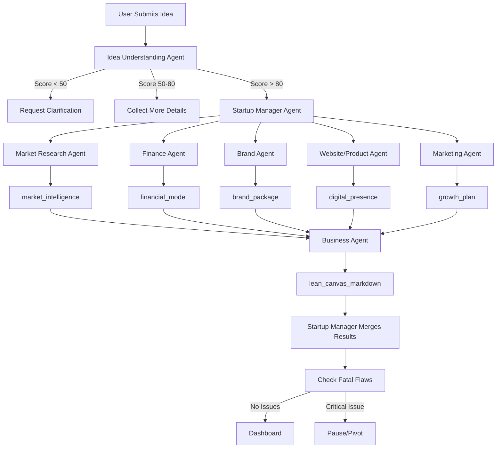

# Agent Harness Documentation

> **Purpose:** This document defines the harness configuration for each of the 7 agents in the Agentic Workflow system. Each agent has explicit boundaries for Tools, Guardrails, Shared State Interaction (`share_schema`), and Response Formats to ensure predictable JSON output for the frontend (Zustand/React).

---

## Agent Harness Overview

The harness configuration ensures:

- **Predictable JSON Output:** Frontend receives perfectly structured data
- **State Safety:** No runtime crashes when rendering dynamic UI elements
- **Zero-Backend Reliability:** Stateless agents with explicit input/output contracts
- **Polymorphic Safety:** Flexible input handling without validation errors

### Harness Components for Each Agent

| Component | Purpose | Format |
|-----------|---------|--------|
| **Skills** | Agent capabilities | Markdown files in [`Agents_skills/`](../../Agents_skills/) |
| **Tools** | External capabilities | List |
| **Guardrails** | Safety constraints | Bullet list |
| **Shared State (share_schema)** | Read/Write boundaries | YAML-style |
| **Response Format (response_format)** | Output schema | Pydantic code |
| **Deliverable (.md / Downloadable)** | Exportable document specifications | Bullet list with checked items |

---

## Agent Specifications

---

### 1. Idea Understanding Agent (The Gatekeeper)

**Role:** Validates and scores raw business ideas before workflow entry.

**Skills:**
- [Structural Validation, Semantic Analysis, Rating](../../Agents_skills/Validation/SKILL.md)

**Tools:**
- None (Runs statelessly via fast inference models)

**Guardrails:**
- **Input Sanity:** Block empty inputs or random character strings (e.g., "asdfgh")
- **Tone Alignment:** Ensure constructive feedback, even for low-scoring ideas (prevent aggressive LLM criticism)

**Shared State Read/Write (`share_schema`):**
```yaml
reads:
  - raw_user_idea

writes:
  - validation_data
```

**Response Format (`response_format`):**
```python
from pydantic import BaseModel, Field

class ValidationResult(BaseModel):
    clarity_score: int = Field(..., description="Coherence score out of 100")
    actionability_score: int = Field(..., description="Viability score out of 100")
    uniqueness_score: int = Field(..., description="Differentiation score out of 100")
    is_valid: bool = Field(..., description="True if average score >= 50")
    constructive_feedback: str = Field(..., description="Helpful tips for refining the idea")
```

---

### 2. Startup Manager Agent (The Orchestrator)

**Role:** Orchestrates task distribution, dependency mapping, and fatal flaw detection across specialized agents.

**Skills:**
- Task delegation and dependency management
- Fatal flaw detection and workflow pausing
- Agent output merging and coordination

**Tools:**
- State Dispatcher (notifies orchestrator to route downstream steps)

**Guardrails:**
- **State Protection:** Strictly prohibited from overwriting original user answers stored in questionnaire state
- **Loop Halting:** Halts execution instantly if any specialized agent outputs a fatal flaw signal

**Shared State Read/Write (`share_schema`):**
```yaml
reads:
  - Full Master State (StartupBlueprintState)

writes:
  - current_step
  - fatal_flaw_triggered
  - fatal_flaw_reason
```

**Response Format (`response_format`):**
```python
from typing import List
from pydantic import BaseModel, Field

class OrchestrationPlan(BaseModel):
    target_step: str = Field(..., description="Next workflow state")
    execution_order: List[str] = Field(..., description="Order of agents to execute")
    system_status: str = Field("OK", description="System state: OK or ABORTED")
```

---

### 3. Market Research Agent

**Role:** Analyzes competitors, trends, and market sizing to build intelligence package.

**Skills:**
- [Competitor Mapping](../../Agents_skills/Research/competitor-mapping/SKILL.md)
- [Market Sizing](../../Agents_skills/Research/market-sizing/SKILL.md)
- [Persona Creation](../../Agents_skills/Research/persona-creation/SKILL.md)
- [Trend Identification](../../Agents_skills/Research/trend-identification/SKILL.md)

**Tools:**
- `tavily_web_search` (configured with strict query guidelines for real-time data)

**Guardrails:**
- **Verification Requirement:** Must extract and format valid, working external citation URLs
- **Hallucination Blocker:** If competitor pricing or metrics are unknown, must state "Not Publicly Available" instead of fabricating numbers

**Shared State Read/Write (`share_schema`):**
```yaml
reads:
  - raw_user_idea
  - questionnaire.target_customers
  - questionnaire.location

writes:
  - market_intelligence
```

**Response Format (`response_format`):**
```python
from typing import List, Dict, Any
from pydantic import BaseModel, Field

class MarketIntelligence(BaseModel):
    competitors: List[Dict[str, str]] = Field(
        ..., 
        description="List of competitors with URLs and weak spots"
    )
    target_personas: List[Dict[str, Any]] = Field(
        ..., 
        description="Detailed ICP (Ideal Customer Profile) personas"
    )
    market_trends: List[str] = Field(
        ..., 
        description="Top 3 macro trends impacting this industry"
    )
    saturation_level: int = Field(
        ..., 
        description="Market saturation percentage (0-100)"
    )
```

**Deliverable (.md File / Downloadable):**
- **Market Intelligence** (`market_intelligence.md`):
  - ✓ Target market (Ideal customer personas and demographics)
  - ✓ Competitors (Competitor mapping and weaknesses)
  - ✓ Opportunities (Market trends and saturation level)

---

### 4. Finance Agent

**Role:** Calculates costs, revenue projections, pricing tiers, and break-even analysis.

**Skills:**
- [Break-Even Analysis](../../Agents_skills/Finance/break-even-analysis/SKILL.md)
- [Cost Allocation](../../Agents_skills/Finance/cost-allocation/SKILL.md)
- [Pricing Tier Calculation](../../Agents_skills/Finance/pricing-tier-calculation/SKILL.md)
- [Revenue Projection](../../Agents_skills/Finance/revenue-projection/SKILL.md)

**Tools:**
- Math Sandbox Helper (programmatic Python executor for calculations)

**Guardrails:**
- **Value Matching:** Financial totals cannot exceed the maximum ceiling declared in `questionnaire.budget`
- **Sanity Constraints:** Ensure prices, costs, and profits are strictly positive values

**Shared State Read/Write (`share_schema`):**
```yaml
reads:
  - questionnaire.budget
  - market_intelligence.saturation_level

writes:
  - financial_model
```

**Response Format (`response_format`):**
```python
from typing import List, Dict
from pydantic import BaseModel, Field

class FinancialModel(BaseModel):
    initial_setup_costs: List[Dict[str, float]] = Field(
        ..., 
        description="One-time capital expenditures"
    )
    monthly_operating_costs: List[Dict[str, float]] = Field(
        ..., 
        description="Recurring costs (SaaS, Rent, Ads)"
    )
    pricing_tiers: List[Dict[str, Any]] = Field(
        ..., 
        description="Proposed customer pricing models"
    )
    break_even_months: int = Field(
        ..., 
        description="Estimated months to profitability"
    )
```

**Deliverable (.md File / Downloadable):**
- **Financial Model** (`financial_model.md`):
  - ✓ Cost breakdown (Initial setup and monthly operating costs)
  - ✓ Revenue forecast (Break-even timeframe and projections)
  - ✓ Pricing strategy (Proposed tiers and models)

---

### 5. Brand Agent

**Role:** Generates brand identity including names, visual aesthetics, and tone of voice.

**Skills:**
- [Brand Naming Strategies](../../Agents_skills/Branding/brand-naming-strategies/SKILL.md)
- [Mission Statement Copywriting](../../Agents_skills/Branding/mission-statement-copywriting/SKILL.md)
- [Tone of Voice Configuration](../../Agents_skills/Branding/tone-of-voice-configuration/SKILL.md)
- [Visual Aesthetic Generation](../../Agents_skills/Branding/visual-aesthetic-generation/SKILL.md)

**Tools:**
- Simulated domain availability lookup tool

**Guardrails:**
- **Design Guidelines:** Must output actual hex codes (e.g., `#0F172A`) matching standard UI styles (minimalist, high-tech, warm organic) rather than descriptive colors (e.g., "soft blue")
- **Naming Constraint:** Suggestions must consist of single or dual-word names (excluding complex phrases)

**Shared State Read/Write (`share_schema`):**
```yaml
reads:
  - raw_user_idea
  - questionnaire.business_type
  - questionnaire.goal

writes:
  - brand_package
```

**Response Format (`response_format`):**
```python
from typing import List, Dict
from pydantic import BaseModel, Field

class BrandPackage(BaseModel):
    suggested_names: List[str] = Field(
        ..., 
        description="5 unique brand name ideas"
    )
    tagline: str = Field(
        ..., 
        description="A short, catchy marketing headline"
    )
    color_palette: Dict[str, str] = Field(
        ..., 
        description="Hex codes for primary, secondary, and background"
    )
    tone_of_voice: str = Field(
        ..., 
        description="E.g., Professional, Quirky, Educational"
    )
```

**Deliverable (.md File / Downloadable):**
- **Brand Package** (`brand_package.md`):
  - ✓ Logo (Suggested brand names and visual style)
  - ✓ Brand voice (Tone of voice guidelines)
  - ✓ Visual identity (Color palette hex codes and typography guidance)

---

### 6. Website/Product Agent

**Role:** Defines structural features, wireframe layouts, and interactive component routing.

**Skills:**
- [Interactive Component Routing](../../Agents_skills/Website/interactive-component-routing/SKILL.md)
- [Structural Feature Definition](../../Agents_skills/Website/structural-feature-definition/SKILL.md)
- [Wireframe Layout Generation](../../Agents_skills/Website/wireframe-layout-generation/SKILL.md)

**Tools:**
- Sandbox compiler (validates output structure matches design system rules)

**Guardrails:**
- **No Broken HTML:** Must only output JSON data arrays outlining page layout structures (prevents raw LLM code from rendering on client-side)

**Shared State Read/Write (`share_schema`):**
```yaml
reads:
  - raw_user_idea
  - brand_package.color_palette

writes:
  - digital_presence
```

**Response Format (`response_format`):**
```python
from typing import List, Optional
from pydantic import BaseModel, Field

class UISection(BaseModel):
    section_id: str = Field(..., description="E.g., hero, features, contact")
    title: str = Field(..., description="Header for this section")
    body: str = Field(..., description="Target copy tailored to brand voice")
    cta_text: Optional[str] = Field(
        None, 
        description="Button label"
    )

class DigitalPresence(BaseModel):
    wireframe_layout: List[UISection] = Field(
        ..., 
        description="Order of layout blocks on the home page"
    )
    key_features: List[str] = Field(
        ..., 
        description="Core app capabilities or service options"
    )
```

**Deliverable (.md File / Downloadable):**
- **Digital Presence** (`digital_presence.md`):
  - ✓ Website prototype (Layout blocks and key app capabilities)
  - ✓ Landing page (CTA elements and wireframe structure)

---

### 7. Marketing Agent

**Role:** Plans marketing pipeline, campaign structures, and 90-day launch roadmap.

**Skills:**
- [Acquisition Strategy Formulation](../../Agents_skills/Marketing/acquisition-strategy-formulation/SKILL.md)
- [Campaign Structure Design](../../Agents_skills/Marketing/campaign-structure-design/SKILL.md)
- [Marketing Pipeline Planning](../../Agents_skills/Marketing/marketing-pipeline-planning/SKILL.md)
- [Ninety-Day Launch Roadmap](../../Agents_skills/Marketing/ninety-day-launch-roadmap/SKILL.md)

**Tools:**
- `tavily_web_search` (optional, for checking trendy organic growth playbooks)

**Guardrails:**
- **Resource Sanity:** Cannot suggest expensive ad strategies (TV, physical billboards) if `questionnaire.budget` is under $5,000

**Shared State Read/Write (`share_schema`):**
```yaml
reads:
  - questionnaire
  - market_intelligence.target_personas

writes:
  - growth_plan
```

**Response Format (`response_format`):**
```python
from typing import List
from pydantic import BaseModel, Field

class GrowthMilestone(BaseModel):
    days: str = Field(..., description="E.g., 'Days 1-30'")
    focus: str = Field(..., description="Core focus area of this phase")
    tasks: List[str] = Field(..., description="Step-by-step launch tasks")

class GrowthPlan(BaseModel):
    channels: List[str] = Field(
        ..., 
        description="Top 3 customer acquisition channels"
    )
    roadmap: List[GrowthMilestone] = Field(
        ..., 
        description="The definitive first 90-day execution steps"
    )
```

**Deliverable (.md File / Downloadable):**
- **Growth Plan** (`growth_plan.md`):
  - ✓ Marketing strategy (Customer acquisition channels)
  - ✓ First 90-day roadmap (Actionable execution milestones)

---

### 8. Business Agent (The Integrator)

**Role:** Consolidates outputs from all specialized downstream agents to compile a comprehensive, unified Lean Canvas deliverable in Markdown format.

**Skills:**
- [Lean Canvas Compilation](../../Agents_skills/Business/lean-canvas-compilation/SKILL.md)

**Tools:**
- None (Consolidates downstream agent states)

**Guardrails:**
- **Structure Preserving:** Must output a standard 9-box Lean Canvas (Problem, Solution, Key Metrics, Unique Value Proposition, Unfair Advantage, Channels, Customer Segments, Cost Structure, Revenue Streams) as a well-formed Markdown document.
- **Information Fidelity:** Must not hallucinate metrics or values; it must only use information directly derived from the outputs of the Market Research, Finance, Brand, Website/Product, and Marketing agents.

**Shared State Read/Write (`share_schema`):**
```yaml
reads:
  - raw_user_idea
  - market_intelligence
  - financial_model
  - brand_package
  - digital_presence
  - growth_plan

writes:
  - lean_canvas_markdown
```

**Response Format (`response_format`):**
```python
from pydantic import BaseModel, Field

class LeanCanvasOutput(BaseModel):
    lean_canvas_markdown: str = Field(..., description="Complete, formatted Markdown string of the 9-box Lean Canvas")
```

**Deliverable (.md File / Downloadable):**
- **Business Overview** (`business_overview.md`):
  - ✓ Business concept (Consolidated Lean Canvas and business model)

---

## Polymorphic Safety Implementation

> **Critical for Hackathon Stability:** When building stateless schemas, implement Polymorphic Safety using Union type hints to handle flexible input formats.

### Problem
Users may enter data in multiple formats:
- Budget: `5000` (int), `1200.50` (float), or `"extremely low budget"` (string)
- Location: `"San Francisco"` (string), `["SF", "NYC"]` (list), or `null`

### Solution: Union Types

```python
from typing import Union, List, Optional
from pydantic import BaseModel, Field

class PolymorphicQuestionnaire(BaseModel):
    # Safe handling of numeric vs string inputs for budget
    budget: Union[int, float, str] = Field(
        default="Not Specified",
        description="Accommodates direct numbers, decimals, or abstract descriptions from user."
    )
    
    # Safe handling of flexible locations
    location: Union[str, List[str], None] = Field(
        default=None,
        description="Can be a single city, list of cities, 'Online-Only', or null."
    )
    
    # Safe handling of experience level
    experience_level: Union[str, int] = Field(
        default="Beginner",
        description="Can be string descriptor or years of experience."
    )
```

### Benefits
- **No Validation Errors:** Agent parser accepts any format
- **Clean Execution:** Prevents blocked execution from type mismatches
- **Frontend Compatibility:** Zustand state updates seamlessly from these JSON keys

---

## Master State Schema

All agents interact with a shared `StartupBlueprintState`:

```python
from typing import Dict, Any, Optional
from pydantic import BaseModel

class StartupBlueprintState(BaseModel):
    # Phase 1
    raw_user_idea: str
    validation_data: Optional[ValidationResult] = None
    
    # Phase 2
    questionnaire: Dict[str, Any]
    
    # Phase 3-4
    current_step: str
    fatal_flaw_triggered: bool = False
    fatal_flaw_reason: Optional[str] = None
    orchestration_plan: Optional[OrchestrationPlan] = None
    
    # Phase 4 Outputs
    market_intelligence: Optional[MarketIntelligence] = None
    financial_model: Optional[FinancialModel] = None
    brand_package: Optional[BrandPackage] = None
    digital_presence: Optional[DigitalPresence] = None
    growth_plan: Optional[GrowthPlan] = None
    lean_canvas_markdown: Optional[str] = None
    
    # Metadata
    session_id: str
    created_at: str
    updated_at: str
    version: int = 1
```

---

## Agent Execution Flow



---

## Frontend Integration

### Zustand Store Structure

```typescript
// src/stores/useWorkflowStore.ts
import { create } from 'zustand';

interface WorkflowStore {
  // Phase 1
  rawUserIdea: string;
  validationData: ValidationResult | null;
  
  // Phase 2
  questionnaire: Questionnaire;
  
  // Phase 3-4
  currentStep: string;
  fatalFlaw: { triggered: boolean; reason?: string } | null;
  orchestrationPlan: OrchestrationPlan | null;
  
  // Phase 4 Outputs
  marketIntelligence: MarketIntelligence | null;
  financialModel: FinancialModel | null;
  brandPackage: BrandPackage | null;
  digitalPresence: DigitalPresence | null;
  growthPlan: GrowthPlan | null;
  leanCanvasMarkdown: string | null;
  
  // Actions
  setValidationData: (data: ValidationResult) => void;
  setQuestionnaire: (data: Questionnaire) => void;
  updateAgentOutput: (agentName: string, data: any) => void;
  setFatalFlaw: (triggered: boolean, reason?: string) => void;
  reset: () => void;
}

export const useWorkflowStore = create<WorkflowStore>((set) => ({
  // Initial state
  rawUserIdea: '',
  validationData: null,
  questionnaire: {},
  currentStep: 'idea',
  fatalFlaw: null,
  orchestrationPlan: null,
  marketIntelligence: null,
  financialModel: null,
  brandPackage: null,
  digitalPresence: null,
  growthPlan: null,
  leanCanvasMarkdown: null,
  
  // Actions
  setValidationData: (data) => set({ validationData: data }),
  setQuestionnaire: (data) => set({ questionnaire: data }),
  updateAgentOutput: (agentName, data) => 
    set({ [agentName]: data }),
  setFatalFlaw: (triggered, reason) => 
    set({ fatalFlaw: { triggered, reason } }),
  reset: () => set({
    rawUserIdea: '',
    validationData: null,
    questionnaire: {},
    currentStep: 'idea',
    fatalFlaw: null,
    orchestrationPlan: null,
    marketIntelligence: null,
    financialModel: null,
    brandPackage: null,
    digitalPresence: null,
    growthPlan: null,
    leanCanvasMarkdown: null,
  }),
}));
```

---

## TypeScript Type Definitions

For frontend type safety, convert Pydantic schemas to TypeScript interfaces:

```typescript
// src/types/agent-outputs.ts

export interface ValidationResult {
  clarity_score: number;
  actionability_score: number;
  uniqueness_score: number;
  is_valid: boolean;
  constructive_feedback: string;
}

export interface MarketIntelligence {
  competitors: Array<{
    name: string;
    url: string;
    weakness: string;
  }>;
  target_personas: Array<Record<string, any>>;
  market_trends: string[];
  saturation_level: number;
}

export interface LeanCanvasOutput {
  lean_canvas_markdown: string;
}

// ... etc for all agent outputs
```

---

## Testing Checklist

- [ ] All agent response formats validate against Pydantic schemas
- [ ] Guardrails prevent invalid outputs (negative costs, hallucinated URLs, etc.)
- [ ] Shared state interactions respect read/write boundaries
- [ ] Polymorphic inputs parse correctly (Union types)
- [ ] Frontend Zustand stores update correctly from agent outputs
- [ ] Fatal flaw detection halts execution properly
- [ ] All JSON outputs are serializable for frontend consumption

---

## Version History

| Version | Date | Author | Changes |
|---------|------|--------|---------|
| 1.0 | 2026-07-16 | - | Initial harness documentation |
| 1.1 | 2026-07-16 | - | Added skill file references for all 7 agents |
| 1.2 | 2026-07-17 | Antigravity | Added Business Agent harness spec for Lean Canvas compilation |
| 1.3 | 2026-07-17 | Antigravity | Associated downloadable .md deliverables with specialized agents |

---

## Skills Directory Structure

All agent skills are organized in the [`docs/Agents_skills/`](../../Agents_skills/) directory:

```
Agents_skills/
├── Validation/
│   └── SKILL.md                    # Idea Understanding Agent
│
├── Research/
│   ├── competitor-mapping/
│   │   └── SKILL.md
│   ├── market-sizing/
│   │   └── SKILL.md
│   ├── persona-creation/
│   │   └── SKILL.md
│   └── trend-identification/
│       └── SKILL.md
│
├── Finance/
│   ├── break-even-analysis/
│   │   └── SKILL.md
│   ├── cost-allocation/
│   │   └── SKILL.md
│   ├── pricing-tier-calculation/
│   │   └── SKILL.md
│   └── revenue-projection/
│       └── SKILL.md
│
├── Branding/
│   ├── brand-naming-strategies/
│   │   └── SKILL.md
│   ├── mission-statement-copywriting/
│   │   └── SKILL.md
│   ├── tone-of-voice-configuration/
│   │   └── SKILL.md
│   └── visual-aesthetic-generation/
│       └── SKILL.md
│
├── Website/
│   ├── interactive-component-routing/
│   │   └── SKILL.md
│   ├── structural-feature-definition/
│   │   └── SKILL.md
│   └── wireframe-layout-generation/
│       └── SKILL.md
│
└── Marketing/
    ├── acquisition-strategy-formulation/
    │   └── SKILL.md
    ├── campaign-structure-design/
    │   └── SKILL.md
    ├── marketing-pipeline-planning/
    │   └── SKILL.md
    └── ninety-day-launch-roadmap/
        └── SKILL.md
│
└── Business/
    └── lean-canvas-compilation/
        └── SKILL.md
```

Each SKILL.md file contains:
- **Overview**: Purpose and scope of the skill
- **Usage**: How to invoke and use the skill
- **Steps**: Detailed process workflow
- **Example**: Conceptual input/output demonstration
- **Pitfalls**: Common issues and how to avoid them

*Document Status: Complete - All skill references added*
