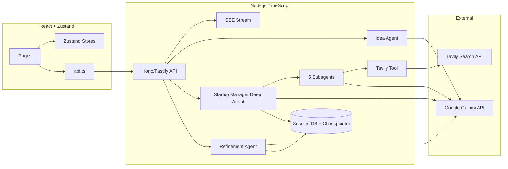

# Agentic Workflow — Implementation Plan

> **For agentic workers:** Implement phase-by-phase. Each phase produces a testable increment. Do not skip ahead without completing acceptance criteria.

**Goal:** Replace the mock React SPA with a real multi-agent startup blueprint builder — TypeScript DeepAgents backend, Gemini LLM, Zustand frontend state, SSE streaming, and full 8-phase workflow from the product spec.

**Architecture:** Monorepo-style layout inside `agentic/`: existing Vite React frontend talks to a new **Node.js TypeScript API** that runs [Deep Agents JS](https://docs.langchain.com/oss/javascript/deepagents/overview) (`deepagents` npm package). The **Startup Manager** is the main deep agent; five specialized agents are **custom subagents** delegated in parallel via the `task` tool. Gemini is the sole LLM provider. Zustand holds client-side workflow UI state; LangGraph checkpointer + SQLite/Postgres holds durable session/blueprint state on the server.

**Tech stack:**

| Layer | Technology |
|-------|------------|
| Agent orchestration | **TypeScript only** — `deepagents`, `@langchain/langgraph`, `langchain` |
| LLM | **Google Gemini** — `google-genai:gemini-*` via `@langchain/google-genai` |
| Real-time search | Tavily Search API (custom LangChain tool) |
| API server | Hono or Fastify (TypeScript) |
| Frontend | React 19 + Vite (existing JSX; migrate pages incrementally) |
| Client state | **Zustand** |
| Persistence | LangGraph checkpointer + DB for blueprints/versions |
| Streaming | Deep Agents `streamEvents` → SSE to frontend |

## Global constraints

- **No Python** for agents, orchestration, or backend logic. All DeepAgents code lives in TypeScript under `server/`.
- **Gemini only** for LLM calls unless explicitly changed. Use `google-genai:` prefix (hyphenated), not `google_genai:`.
- **Follow product spec:** [context/architectureDesign.mmd](../context/architectureDesign.mmd), [context/Workflow v-2.docx](../context/Workflow%20v-2.docx), [AGENT.md](../AGENT.md).
- **Follow design system:** [DESIGN.md](../DESIGN.md) for all UI work.
- **Secrets in env only:** `GOOGLE_API_KEY`, `TAVILY_API_KEY` — never committed.
- **Minimal scope per PR:** one phase or sub-phase at a time.

---

## Repository layout (target)

```
agentic/
├── docs/
│   └── IMPLEMENTATION_PLAN.md      # this file
├── server/                         # NEW — TypeScript DeepAgents backend
│   ├── package.json
│   ├── tsconfig.json
│   ├── .env.example
│   └── src/
│       ├── index.ts                # HTTP server entry
│       ├── config/env.ts
│       ├── routes/
│       │   ├── sessions.ts         # CRUD workflow sessions
│       │   ├── idea.ts             # Phase 1: validate idea
│       │   ├── business.ts         # Phase 2: questionnaire
│       │   ├── orchestrate.ts      # Phase 3–4: run agents
│       │   ├── blueprint.ts        # Phase 6: get blueprint
│       │   ├── refine.ts           # Phase 7: refinement chat
│       │   └── export.ts           # Phase 8: PDF/Markdown
│       ├── agents/
│       │   ├── startup-manager.ts  # Main orchestrator deep agent
│       │   ├── idea-agent.ts       # Idea validation agent
│       │   ├── refinement-agent.ts # Refinement deep agent
│       │   └── subagents/          # 5 specialized subagents
│       │       ├── market-research.ts
│       │       ├── finance.ts
│       │       ├── brand.ts
│       │       ├── website-product.ts
│       │       └── marketing.ts
│       ├── tools/
│       │   ├── tavily-search.ts
│       │   ├── fatal-flaw-signal.ts
│       │   └── blueprint-store.ts
│       ├── schemas/                # Zod output schemas
│       │   ├── idea-validation.ts
│       │   ├── business-info.ts
│       │   ├── blueprint.ts
│       │   └── agent-outputs.ts
│       ├── services/
│       │   ├── session-store.ts
│       │   ├── version-control.ts
│       │   └── sse-stream.ts
│       └── AGENTS.md               # Deep Agents memory file
├── src/                            # Existing React frontend
│   ├── stores/                     # NEW — Zustand
│   │   ├── useAuthStore.ts
│   │   ├── useWorkflowStore.ts
│   │   ├── useBlueprintStore.ts
│   │   └── useAgentProgressStore.ts
│   ├── services/                   # NEW — API client
│   │   └── api.ts
│   └── pages/                      # Update existing pages
└── package.json                    # Optional root workspace
```

---

## System architecture



### Deep Agents mapping (spec → code)

| Product concept | Deep Agents construct |
|---------------|----------------------|
| Startup Manager Agent | Main `createDeepAgent()` orchestrator |
| Idea Understanding Agent | Separate deep agent OR first API route (pre-orchestration) |
| 5 Specialized Agents | Custom `subagents[]` with `responseFormat` (Zod schemas) |
| Parallel execution | Multiple `task` calls in one coordinator turn ([subagents docs](https://docs.langchain.com/oss/javascript/deepagents/subagents)) |
| Fatal flaw detection | Custom `signal_fatal_flaw` tool → orchestrator pause/pivot via `interrupt_on` |
| Persistence & versioning | LangGraph checkpointer + `version-control.ts` service |
| Refinement | Separate refinement deep agent with blueprint context in virtual FS |
| Real-time data | Tavily custom tool shared across market/finance subagents |
| Agent memory / conventions | `server/src/AGENTS.md` passed to `memory: ["./AGENTS.md"]` |

### Gemini configuration

```typescript
// server/src/config/model.ts
import { createDeepAgent } from "deepagents";

// Preferred: provider:model string (use hyphenated google-genai)
const MODEL = process.env.GEMINI_MODEL ?? "google-genai:gemini-2.5-flash";

export function createGeminiAgent(config: Parameters<typeof createDeepAgent>[0]) {
  return createDeepAgent({
    model: MODEL,
    ...config,
  });
}
```

Required env vars:

```bash
GOOGLE_API_KEY=...
TAVILY_API_KEY=...
GEMINI_MODEL=google-genai:gemini-2.5-flash
DATABASE_URL=...
PORT=3001
```

Peer dependencies (install in `server/`):

```bash
npm install deepagents langchain @langchain/core @langchain/langgraph \
  @langchain/google-genai @langchain/langgraph-checkpoint zod hono
```

---

## Zustand store design

Zustand manages **UI and client cache only**. Source of truth for blueprint data is the server.

### `useWorkflowStore`

```typescript
interface WorkflowStore {
  sessionId: string | null;
  phase: 'idea' | 'business' | 'planning' | 'agents' | 'dashboard' | 'refinement';
  idea: { text: string; score?: number; feedback?: string; needsClarification: boolean };
  businessInfo: BusinessInfo | null;
  setSessionId: (id: string) => void;
  setPhase: (phase: WorkflowStore['phase']) => void;
  setIdea: (idea: Partial<WorkflowStore['idea']>) => void;
  setBusinessInfo: (info: BusinessInfo) => void;
  reset: () => void;
}
```

### `useAgentProgressStore`

Drives `SpecializedAgentsPage` live UI from SSE events:

```typescript
interface AgentProgressStore {
  agents: Record<string, { status: 'pending' | 'running' | 'completed' | 'failed'; output?: string }>;
  fatalFlaw: { detected: boolean; message?: string; pivoting: boolean } | null;
  updateAgent: (name: string, update: Partial<AgentProgressStore['agents'][string]>) => void;
  setFatalFlaw: (flaw: AgentProgressStore['fatalFlaw']) => void;
  reset: () => void;
}
```

### `useBlueprintStore`

```typescript
interface BlueprintStore {
  currentVersion: number;
  blueprint: Blueprint | null;
  versions: { version: number; createdAt: string; summary: string }[];
  setBlueprint: (bp: Blueprint, version: number) => void;
  addVersion: (summary: string) => void;
  rollback: (version: number) => void;
}
```

Persist `sessionId` to `localStorage` (`agentic:sessionId`) for refresh recovery. Do **not** persist full blueprint in localStorage — fetch from API.

Reference: [Zustand](https://zustand-demo.pmnd.rs/)

---

## API contract (REST + SSE)

| Method | Path | Phase | Description |
|--------|------|-------|-------------|
| `POST` | `/api/sessions` | — | Create workflow session, return `sessionId` |
| `POST` | `/api/sessions/:id/idea/validate` | 1 | Normal + LLM validation → score + decision |
| `POST` | `/api/sessions/:id/business` | 2 | Save 8-field questionnaire |
| `POST` | `/api/sessions/:id/orchestrate` | 3–4 | Start Startup Manager run |
| `GET` | `/api/sessions/:id/stream` | 3–4 | SSE: subagent status, tool calls, progress |
| `GET` | `/api/sessions/:id/blueprint` | 6 | Latest blueprint JSON |
| `POST` | `/api/sessions/:id/refine` | 7 | Send refinement message |
| `GET` | `/api/sessions/:id/versions` | 7 | List blueprint versions |
| `POST` | `/api/sessions/:id/rollback` | 7 | Rollback to version N |
| `GET` | `/api/sessions/:id/export` | 8 | Export Markdown/HTML/PDF |

### Phase 1 response shape (Zod)

```typescript
const IdeaValidationResult = z.object({
  score: z.number().min(0).max(100),
  decision: z.enum(['clarify', 'collect_more', 'proceed']),
  clarity: z.number(),
  actionability: z.number(),
  uniqueness: z.number(),
  feedback: z.string(),
  clarificationQuestions: z.array(z.string()).optional(),
  structuredIdea: z.object({
    concept: z.string(),
    targetAudience: z.string().optional(),
    problem: z.string().optional(),
  }),
});
```

Decision engine (server-side, deterministic):

| Score | `decision` |
|-------|------------|
| < 50 | `clarify` |
| 50–80 | `collect_more` |
| > 80 | `proceed` |

### Blueprint shape (aggregated from subagents)

```typescript
const Blueprint = z.object({
  businessOverview: z.object({ concept: z.string(), summary: z.string() }),
  marketIntelligence: z.object({
    tam: z.string(), competitors: z.array(z.string()), opportunities: z.array(z.string()),
  }),
  financialModel: z.object({
    costBreakdown: z.array(z.object({ item: z.string(), cost: z.number() })),
    revenueForecast: z.string(), pricingStrategy: z.string(), breakevenMonth: z.number(),
  }),
  brandPackage: z.object({
    names: z.array(z.string()), voice: z.string(), palette: z.array(z.string()), logoConcept: z.string(),
  }),
  digitalPresence: z.object({
    landingPageOutline: z.string(), features: z.array(z.string()), stack: z.array(z.string()),
  }),
  growthPlan: z.object({
    channels: z.array(z.string()), acquisitionPlan: z.string(), roadmap90Day: z.array(z.string()),
  }),
});
```

---

## Implementation phases

### Phase 0 — Project scaffolding (1–2 days)

**Deliverable:** `server/` runs locally, health check responds, frontend proxies API calls.

- [ ] Create `server/` with TypeScript, `tsx` dev runner, ESLint
- [ ] Add `.env.example` with required keys
- [ ] Add Hono server with `GET /health`
- [ ] Configure Vite proxy: `/api` → `http://localhost:3001`
- [ ] Install Zustand in frontend: `npm install zustand`
- [ ] Create empty store files under `src/stores/`
- [ ] Create `src/services/api.ts` with typed fetch wrapper

**Acceptance:** `curl localhost:3001/health` returns 200; frontend dev server starts unchanged.

---

### Phase 1 — Session + Idea Validation (3–4 days)

**Deliverable:** Real LLM idea scoring with decision engine; `IdeaPromptPage` wired to API.

**Backend tasks:**

- [ ] Create `server/src/schemas/idea-validation.ts` (Zod schemas above)
- [ ] Create `server/src/agents/idea-agent.ts`:

```typescript
import { createDeepAgent } from "deepagents";
import { IdeaValidationResult } from "../schemas/idea-validation.js";

export const ideaAgent = createDeepAgent({
  model: process.env.GEMINI_MODEL ?? "google-genai:gemini-2.5-flash",
  systemPrompt: `You evaluate startup ideas. Score clarity, actionability, and competitive uniqueness (0-100 each).
Return structured JSON matching the schema. Be honest about weak ideas.`,
  responseFormat: IdeaValidationResult, // Zod schema
});
```

- [ ] Implement `POST /api/sessions` and `POST /api/sessions/:id/idea/validate`
- [ ] Add normal validation (non-empty, min length) before LLM call
- [ ] Apply decision engine thresholds server-side (don't trust LLM for routing alone)
- [ ] Persist session + idea to DB

**Frontend tasks:**

- [ ] Implement `useWorkflowStore` with idea state
- [ ] Update `IdeaPromptPage.jsx`:
  - Call validate API on submit
  - Show score + feedback
  - If `clarify`: show clarification questions inline, allow resubmit
  - If `collect_more` or `proceed`: navigate to `/business-info`
- [ ] Add loading/error states

**Acceptance:** Submitting an idea returns a real Gemini-generated score; score < 50 shows clarification UI; score ≥ 50 advances workflow.

---

### Phase 2 — Business Questionnaire (2–3 days)

**Deliverable:** Full 8-field form persisted to session.

**Backend:**

- [ ] Create `server/src/schemas/business-info.ts` with all 8 fields from spec
- [ ] Implement `POST /api/sessions/:id/business`
- [ ] Validate required fields server-side

**Frontend:**

- [ ] Rewrite `BusinessInfoPage.jsx` with all fields:
  - Location, Budget, Target customers, Business type, Experience level
  - Goal type (radio: local / scalable / online)
  - Core painpoint, Launch timeline
- [ ] Save to `useWorkflowStore` + POST to API
- [ ] Navigate to `/planning` on success

**Acceptance:** All 8 fields saved; reload session restores form data from API.

---

### Phase 3 — Startup Manager + Subagent definitions (4–5 days)

**Deliverable:** Orchestrator agent defined with 5 typed subagents; manual invoke returns structured blueprint (no streaming yet).

**Backend:**

- [ ] Create Tavily tool: `server/src/tools/tavily-search.ts`
- [ ] Create fatal flaw tool: `server/src/tools/fatal-flaw-signal.ts`
- [ ] Define 5 subagents in `server/src/agents/subagents/`:

```typescript
// Example: market-research.ts
export const marketResearchSubagent = {
  name: "market-research",
  description: "Analyzes competitors, customer trends, and market size using web search.",
  systemPrompt: `You are a market research analyst. Use tavily_search for real data.
Output structured market intelligence.`,
  tools: [tavilySearch],
  responseFormat: MarketIntelligenceSchema,
};
```

Repeat for: `finance`, `brand`, `website-product`, `marketing`.

- [ ] Create Startup Manager in `server/src/agents/startup-manager.ts`:

```typescript
import { createDeepAgent } from "deepagents";
import { marketResearchSubagent } from "./subagents/market-research.js";
// ... other subagents

export const startupManager = createDeepAgent({
  model: process.env.GEMINI_MODEL ?? "google-genai:gemini-2.5-flash",
  memory: ["./AGENTS.md"],
  systemPrompt: `You are the Startup Manager. Given a validated idea and business questionnaire:
1. Use write_todos to plan work
2. Delegate to ALL five subagents in parallel via task tool
3. If any subagent signals fatal_flaw, pause and reassess
4. Merge outputs into a unified blueprint`,
  subagents: [
    marketResearchSubagent,
    financeSubagent,
    brandSubagent,
    websiteProductSubagent,
    marketingSubagent,
  ],
  tools: [fatalFlawSignal],
});
```

- [ ] Write `server/src/AGENTS.md` with blueprint conventions, output format rules, fatal flaw criteria
- [ ] Implement blueprint merger in `server/src/services/blueprint-merger.ts`
- [ ] Implement `POST /api/sessions/:id/orchestrate` (sync invoke for now)

**Acceptance:** Calling orchestrate with a test session returns a complete 6-section blueprint JSON from Gemini subagents.

---

### Phase 4 — SSE streaming + agent progress UI (3–4 days)

**Deliverable:** Live agent cards on `SpecializedAgentsPage` driven by real subagent events.

**Backend:**

- [ ] Implement `server/src/services/sse-stream.ts` wrapping Deep Agents event streaming ([event streaming docs](https://docs.langchain.com/oss/javascript/deepagents/event-streaming))
- [ ] Add `GET /api/sessions/:id/stream` SSE endpoint
- [ ] Emit events: `agent.started`, `agent.completed`, `agent.failed`, `fatal_flaw`, `blueprint.ready`

```typescript
const stream = await startupManager.streamEvents(input, { version: "v3" });
for await (const subagent of stream.subagents) {
  emitSSE({ type: "agent.started", name: subagent.name });
  await subagent.output;
  emitSSE({ type: "agent.completed", name: subagent.name });
}
```

**Frontend:**

- [ ] Implement `useAgentProgressStore`
- [ ] Rewrite `SpecializedAgentsPage.jsx`:
  - Connect to SSE on mount
  - Show 5 agent cards (not 3)
  - Update status from store
  - Handle fatal flaw → show pivot UI
  - Navigate to dashboard on `blueprint.ready`
- [ ] Update `PlanningPage.jsx` to call `/orchestrate` then redirect to `/specialized-agents` with stream

**Acceptance:** User sees 5 agents activate in real time; fatal flaw pauses workflow with message; completion navigates to dashboard with real data.

---

### Phase 5 — Blueprint dashboard (2–3 days)

**Deliverable:** `DashboardPage` renders all 6 blueprint sections from API.

**Backend:**

- [ ] Implement `GET /api/sessions/:id/blueprint`
- [ ] Store blueprint with version number after orchestration completes

**Frontend:**

- [ ] Implement `useBlueprintStore`
- [ ] Rewrite `DashboardPage.jsx`:
  - Fetch blueprint on mount
  - Render 6 sections per spec (not 3 hardcoded cards)
  - Remove mock TAM/breakeven values
  - Link to refinement

**Acceptance:** Dashboard shows data from the user's actual idea and questionnaire, not hardcoded values.

---

### Phase 6 — Refinement + version control (4–5 days)

**Deliverable:** Interactive refinement chat updates blueprint sections; rollback works.

**Backend:**

- [ ] Create `server/src/agents/refinement-agent.ts` with blueprint context injected
- [ ] Implement `POST /api/sessions/:id/refine` — parse user intent, update relevant sections
- [ ] Implement version control in `server/src/services/version-control.ts`:
  - Save snapshot before each refinement
  - `GET /api/sessions/:id/versions`
  - `POST /api/sessions/:id/rollback`
- [ ] Handle disagreement patterns ("I don't like these names") per spec

**Frontend:**

- [ ] Rewrite `RefinementPage.jsx`:
  - Left panel: live blueprint sections from `useBlueprintStore`
  - Right panel: real chat via refine API
  - Version selector + rollback button
  - Highlight changed sections after refinement

**Acceptance:** "Make it cheaper" updates financial model; "Target university students" updates persona/marketing; rollback restores prior version.

---

### Phase 7 — Export (2–3 days)

**Deliverable:** Downloadable Markdown and PDF blueprint.

**Backend:**

- [ ] Implement `GET /api/sessions/:id/export?format=markdown|html|pdf`
- [ ] Markdown: template from blueprint JSON
- [ ] PDF: use `puppeteer` or `@react-pdf/renderer` server-side from HTML template

**Frontend:**

- [ ] Add export buttons on dashboard
- [ ] Download trigger via API

**Acceptance:** User exports investor-ready PDF with all 6 sections.

---

### Phase 8 — Auth, polish, production (3–4 days)

**Deliverable:** Production-ready MVP.

- [ ] Replace mock auth with real auth (or keep mock + route guards for MVP)
- [ ] Add `RequireAuth` wrapper for workflow routes
- [ ] Associate sessions with user ID
- [ ] Update `index.html` title to "Agentic Workflow"
- [ ] Add API status indicator for Tavily (per workflow spec)
- [ ] Error boundaries + retry on agent failures
- [ ] Rate limiting on orchestrate endpoint
- [ ] Docker Compose: frontend + server + Postgres
- [ ] Update [AGENT.md](../AGENT.md) to reflect real architecture

**Acceptance:** Full end-to-end flow works for a new user; sessions persist across refresh; no secrets in repo.

---

## Subagent specifications (reference)

| Subagent name | Tools | Output schema | Key responsibilities |
|---------------|-------|---------------|---------------------|
| `market-research` | `tavily_search` | `MarketIntelligenceSchema` | TAM, competitors, trends |
| `finance` | `tavily_search` | `FinancialModelSchema` | Costs, revenue, breakeven |
| `brand` | — | `BrandPackageSchema` | Names, voice, palette, logo concept |
| `website-product` | — | `DigitalPresenceSchema` | Landing page, features, stack |
| `marketing` | `tavily_search` | `GrowthPlanSchema` | Channels, acquisition, 90-day roadmap |

All subagents use Gemini via inherited model from Startup Manager unless a cheaper model is needed for simple tasks (e.g., `gemini-2.5-flash` for brand, `gemini-2.5-pro` for finance).

---

## Risk & mitigation

| Risk | Mitigation |
|------|------------|
| Gemini provider string errors | Always use `google-genai:` prefix; test with minimal agent first |
| Long orchestration runs timeout HTTP | Use SSE + async session status; don't block REST response |
| Subagent context bloat | Deep Agents isolates subagent context by design; use `responseFormat` for compact handoff |
| Tavily rate limits | Cache search results per session; debounce duplicate queries |
| Blueprint inconsistency across agents | Startup Manager merges with explicit Zod validation; reject invalid merges |
| Frontend/backend drift | Shared Zod schemas exported from server or duplicated with contract tests |

---

## Estimated timeline

| Phase | Duration | Cumulative |
|-------|----------|------------|
| 0 — Scaffolding | 1–2 days | 2 days |
| 1 — Idea validation | 3–4 days | 6 days |
| 2 — Business form | 2–3 days | 9 days |
| 3 — Agents setup | 4–5 days | 14 days |
| 4 — Streaming UI | 3–4 days | 18 days |
| 5 — Dashboard | 2–3 days | 21 days |
| 6 — Refinement | 4–5 days | 26 days |
| 7 — Export | 2–3 days | 29 days |
| 8 — Production | 3–4 days | **~33 days** |

---

## What stays mock vs real (after full plan)

| Feature | After Phase 8 |
|---------|---------------|
| Idea validation | Real Gemini |
| Business questionnaire | Real persistence |
| Agent orchestration | Real DeepAgents TS |
| Parallel agents | Real 5 subagents |
| Tavily search | Real API |
| Dashboard data | Real blueprint |
| Refinement chat | Real Gemini + versioning |
| Export | Real Markdown/PDF |
| Auth | TBD (Phase 8) |

---

## Key references

- [Deep Agents JS overview](https://docs.langchain.com/oss/javascript/deepagents/overview)
- [Deep Agents subagents (JS)](https://docs.langchain.com/oss/javascript/deepagents/subagents)
- [Deep Agents event streaming](https://docs.langchain.com/oss/javascript/deepagents/event-streaming)
- [Deep Agents customization / Gemini](https://docs.langchain.com/oss/javascript/deepagents/customization)
- [deepagentsjs GitHub](https://github.com/langchain-ai/deepagentsjs)
- [Zustand](https://zustand-demo.pmnd.rs/)
- Project spec: [architectureDesign.mmd](../context/architectureDesign.mmd), [Workflow v-2.docx](../context/Workflow%20v-2.docx)

---

*Plan version: 2026-07-16 — TypeScript DeepAgents only, Gemini LLM, Zustand client state.*
